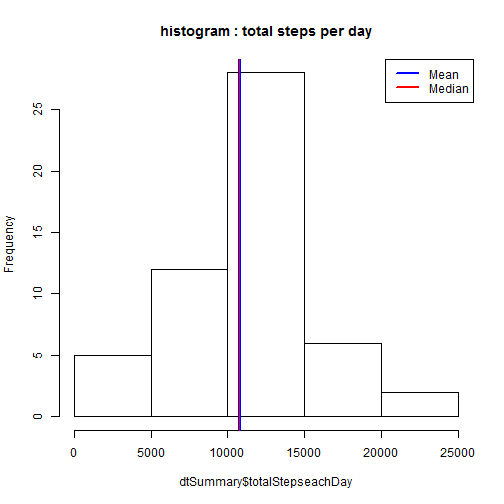
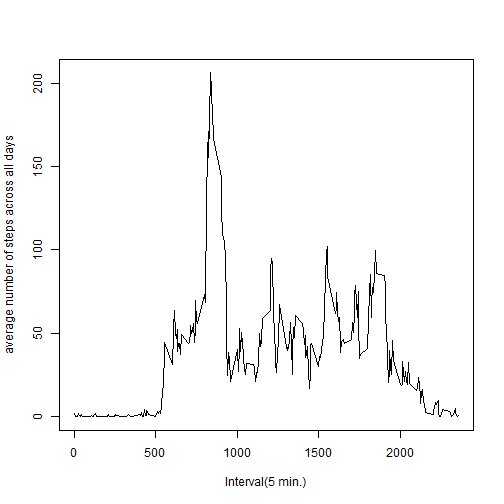
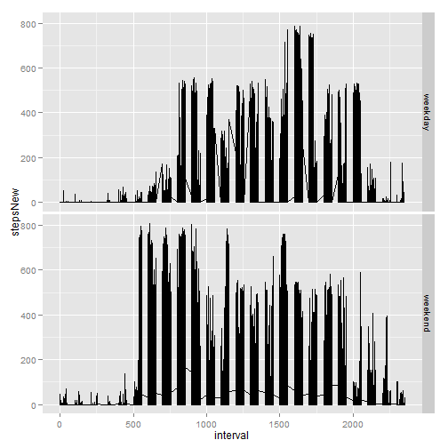
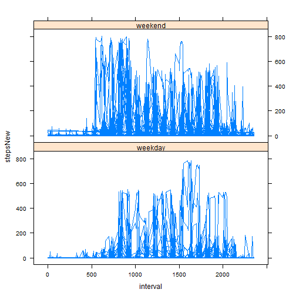

Required packages. Below packages/libraries needs to be installed and loaded before you run this script.


```r
install.packages("knitr")
```

```
## Error: trying to use CRAN without setting a mirror
```

```r
install.packages("ggplot2")
```

```
## Error: trying to use CRAN without setting a mirror
```

```r
install.packages("data.table")
```

```
## Error: trying to use CRAN without setting a mirror
```

```r
library(data.table)
```


# Reproducible Research: Peer Assessment 1

## Loading and preprocessing the data

1. Load the data (i.e. read.csv())

2. Process/transform the data (convert text to date ).


```r
dt <- read.csv(file = "activity.csv")
dt$date_t <- as.Date(as.character(dt$date))
dtt <- as.data.table(dt)
dtSummary <- dtt[, list(totalStepseachDay = sum(steps), num = .N), by = date_t]
```


## What is mean total number of steps taken per day?

[1]. Make a histogram of the total number of steps taken each day


```r
hist(dtSummary$totalStepseachDay, main = "histogram : total steps per day")
abline(v = mean(dtSummary$totalStepseachDay, na.rm = TRUE), col = "blue", lwd = 3)
abline(v = median(dtSummary$totalStepseachDay, na.rm = TRUE), col = "red", lwd = 1)
legend(x = "topright", c("Mean", "Median"), col = c("blue", "red"), lwd = c(2, 
    2))
```

 


[2]. Calculate and report the mean and median total number of steps taken per day

Mean total number of steps taken per day :

```r
mean(dtSummary$totalStepseachDay, na.rm = TRUE)
```

```
## [1] 10766
```


Median value : 

```r
median(dtSummary$totalStepseachDay, na.rm = TRUE)
```

```
## [1] 10765
```


## What is the average daily activity pattern?

1. Make a time series plot (i.e. type = "l") of the 5-minute interval (x-axis) and the average number of steps taken, averaged across all days (y-axis)


```r
dti <- dtt[, list(avg = mean(steps, na.rm = TRUE), num = .N), by = interval]
with(dti, plot(x = interval, y = avg, ylab = "average number of steps across all days", 
    xlab = "Interval(5 min.)", type = "l"))
```

 


2. Which 5-minute interval, on average across all the days in the dataset, contains the maximum number of steps?
  
  5 Min. Intervel with maximum average number of steps.


```r
dti[avg == max(dti$avg), ]
```

```
##    interval   avg num
## 1:      835 206.2  61
```


## Imputing missing values

1. Calculate and report the total number of missing values in the dataset (i.e. the total number of rows with NAs)
Total # of Nas

```r
temp2 <- dtt[(is.na(dtt$steps) == TRUE)]
length(temp2$steps)
```

```
## [1] 2304
```

or it can be found from last line of summary

```r
summary(dtt)
```

```
##      steps               date          interval        date_t          
##  Min.   :  0.0   2012-10-01:  288   Min.   :   0   Min.   :2012-10-01  
##  1st Qu.:  0.0   2012-10-02:  288   1st Qu.: 589   1st Qu.:2012-10-16  
##  Median :  0.0   2012-10-03:  288   Median :1178   Median :2012-10-31  
##  Mean   : 37.4   2012-10-04:  288   Mean   :1178   Mean   :2012-10-31  
##  3rd Qu.: 12.0   2012-10-05:  288   3rd Qu.:1766   3rd Qu.:2012-11-15  
##  Max.   :806.0   2012-10-06:  288   Max.   :2355   Max.   :2012-11-30  
##  NA's   :2304    (Other)   :15840
```


input average steps across days for given interval for missing data

dt3$newSteps <-  ifelse(is.na(dt3$steps), dti[(dti$interval==dtt$interval)]$avg,dt3$steps)


### inputting missing valuse 
Defint a functio nto look for average number of steps across all day for given interval 


```r
getMean <- function(x) {
    dti[(dti$interval == x)]$avg
}


inputMissing <- function(df) {
    test <- numeric()
    count = 0
    for (i in 1:nrow(df)) {
        row <- df[i, ]
        if (is.na(row$steps)) {
            test <- rbind(test, getMean(row$interval))
        } else {
            test <- rbind(test, row$steps)
        }
    }
    test
}

tempDf <- dtt
testV <- inputMissing(tempDf)
tempDf$stepsNew <- testV
```


[4]. Make a histogram of the total number of steps taken each day and Calculate and report the mean and median total number of steps taken per day. Do these values differ from the estimates from the first part of the assignment? What is the impact of imputing missing data on the estimates of the total daily number of steps?


```r
dtSummaryFilledin <- tempDf[, list(totalStepseachDayFilledin = sum(stepsNew), 
    num = .N), by = date_t]
hist(dtSummaryFilledin$totalStepseachDayFilledin, main = "histogram : total steps per day( Filled in values for NA)")
abline(v = mean(dtSummaryFilledin$totalStepseachDayFilledin, na.rm = TRUE), 
    col = "blue", lwd = 3)
abline(v = median(dtSummaryFilledin$totalStepseachDayFilledin, na.rm = TRUE), 
    col = "red", lwd = 1)
legend(x = "topright", c("Mean", "Median"), col = c("blue", "red"), lwd = c(2, 
    2))
```

 


Mean total number of steps taken per day :

```r
mean(dtSummaryFilledin$totalStepseachDayFilledin, na.rm = TRUE)
```

```
## [1] 10766
```


Median value : 

```r
median(dtSummaryFilledin$totalStepseachDayFilledin, na.rm = TRUE)
```

```
## [1] 10766
```


## Are there differences in activity patterns between weedtSummarykdays and weekends?
graphics with ggplot2

```r
library(ggplot2)
temp5 <- transform(tempDf, Weekday = ifelse((weekdays(tempDf$date_t) == "Sunday" | 
    weekdays(tempDf$date_t) == "Saturday"), "weekday", "weekend"))
temp6 <- transform(temp5, Weekday = factor(Weekday))

qplot(interval, stepsNew, data = temp6, facets = Weekday ~ ., type = "l", geom = c("line"))
```

 


graphics with lattice

```r
library(lattice)
with(temp6, xyplot(stepsNew ~ interval | Weekday, layout = c(2, 1), type = "l"))
```

 


